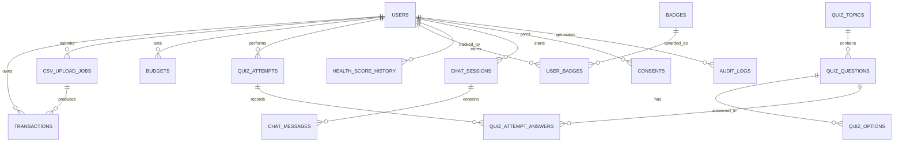

# BankOPedia — Schema Design Notes

## 1. ID strategy (per table, justified)
| Table | Key | Why |
|---|---|---|
| users, transactions, csv_upload_jobs, budgets, quiz_attempts, chat_sessions | UUID | Exposed externally (`job_id`, `context_id`, JWT `sub`) or referenced across many FKs where guessability/enumeration matters (transactions are financial data). |
| bankopedia_terms, quiz_topics/questions/options, badges, category_mapping_rules, prompt_templates | SERIAL/BIGSERIAL | Internal reference data, never in a URL, high read/low write, small joins benefit from a 4-byte int over 16-byte UUID. |
| consents, audit_logs, quiz_attempt_answers, health_score_history, chat_messages | BIGSERIAL | Pure append-only logs, internal only, ordering by id is useful, no reason to pay the UUID index-bloat cost. |

Not using ULID/Snowflake: single-region Postgres at MVP scale (5k users) has no multi-node ID-collision problem to solve — that's premature for this stage (same objection I raised about partitioning/DR in the TRD).

## 2. ERD (core relationships)

## 3. Fixes applied vs the source docs (see prior message for full list)
1. `bankopedia_terms`: `UNIQUE(term)` → `UNIQUE(term, language)` — the original broke multi-language storage.
2. Added `csv_upload_jobs` — required by the async API contract, absent from PRD §14.
3. `audit_logs.user_id` uses `ON DELETE SET NULL`, not `CASCADE` — audit trail must outlive account deletion, which the PRD/TRD never reconciled with DPDP erasure.
4. Dedup uses an exact `sha256(date, merchant, amount, user_id)` unique index — not the PRD's "within 1 cent" float-tolerance logic, which doesn't apply to a `DECIMAL(10,2)` column.
5. `password_hash` sized for Argon2id output — **you still need to pick bcrypt vs Argon2id**; I went with the TRD's ADR since it's the more recent/deliberate decision, but this is a decision for you to ratify, not me.

## 4. What's still open (you decide, not me)
- bcrypt vs Argon2id — pick one, update FR-002 or the ADR to match.
- JWT storage: `localStorage` (TRD) contradicts your own STRIDE spoofing mitigation. Recommend httpOnly cookie + CSRF token instead, but that's a frontend/auth architecture call, not a schema one.
- Quiz question pool size per topic isn't guaranteed ≥10 — add a seed-data validation check, not a DB constraint (can't enforce "count ≥ 10" declaratively without a trigger, and a trigger here is overkill for reference data you control).

## 5. Scale path (only what changes, not a re-architecture)
| Users | What actually breaks first | Fix |
|---|---|---|
| 5k (MVP) | Nothing — this schema holds. | — |
| 100k | `transactions` table ~5–10M rows/month; sequential scans on dashboard queries slow down. | Add `BRIN` index on `txn_date` alongside the existing btree; consider monthly partitioning **only if** query latency data shows it's needed. |
| 1M | Single Postgres instance write throughput becomes the bottleneck for `transactions` inserts during CSV job bursts. | Read replicas for dashboard reads; partition `transactions` by month for real (not speculatively, as the TRD did at MVP). |
| 10M | `audit_logs` and `chat_messages` (append-only, unbounded) dominate storage. | Time-based partitioning + cold-storage archival (S3) for both; move `bankopedia_terms` search to a dedicated search service if fuzzy-match latency degrades. |
